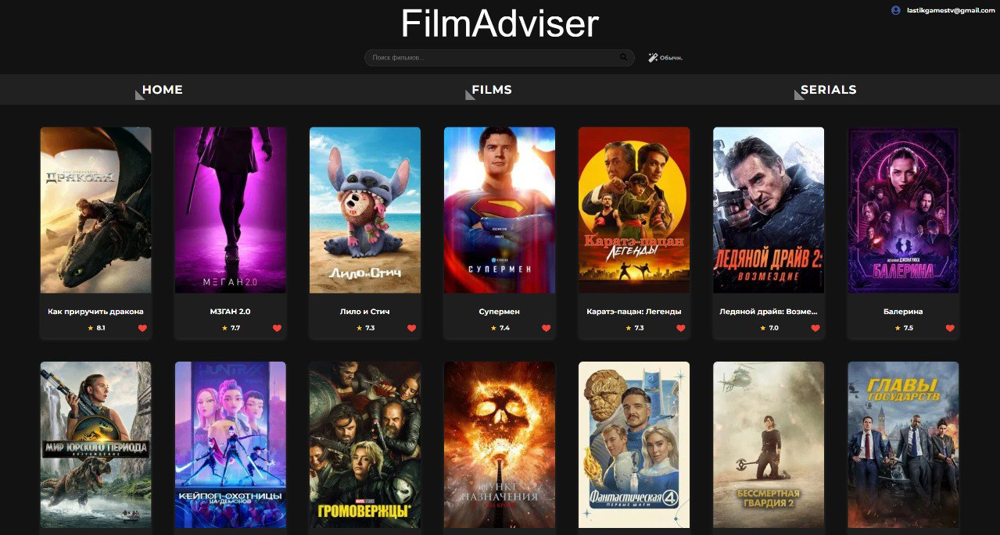

# Интеллектуальный киносервис "FilmAdvicer"(Frontend)
 Это клиентская часть проекта "FilmAdviser" — одностраничное веб-приложение (SPA), созданное на React для комфортного поиска фильмов и сериалов. Приложение позволяет просматривать популярные новинки, искать контент по названию, а также получать персональные рекомендации и обзоры, сгенерированные искусственным интеллектом.

### ➡️ **[Посмотреть живое демо (Live Demo)](https://doomsday058.github.io/online-cinema-frontend/)**

### 🧠 **[Ссылка на репозиторий flask-сервера](https://github.com/Doomsday058/online-cinema-flask.git)**
### 🧠 **[Ссылка на репозиторий бэкенд-сервера](https://github.com/Doomsday058/online-cinema-backend)**

---

### 🚀 Основные возможности

* **Персональные рекомендации:** Лента фильмов, подобранная на основе предпочтений пользователя.
* **AI-обзоры:** Уникальные обзоры на фильмы, сгенерированные моделью GPT.
* **Расширенный поиск:** Возможность поиска по текстовому запросу на естественном языке.
* **Авторизация и избранное:** Регистрация, вход и сохранение любимых фильмов в личный список.
* **Адаптивный дизайн:** Корректное отображение на всех устройствах.

---

### 🛠️ Технологический стек

* **React**
* **TypeScript**
* **React Router**
* **Axios**
* **CSS Modules / SCSS**
  
---

### 📦 Установка и запуск

1.  **Клонируйте репозиторий:**
    ```bash
    git clone [https://github.com/Doomsday058/online-cinema-frontend.git](https://github.com/Doomsday058/online-cinema-frontend.git)
    cd online-cinema-frontend
    ```

2.  **Установите зависимости:**
    ```bash
    npm install
    ```

3.  **Создайте файл `.env`** в корне проекта и добавьте переменные для подключения к бэкендам:
    ```
    REACT_APP_NODE_API_URL=https://...
    REACT_APP_PYTHON_AI_URL=https://...
    ```

4.  **Запустите приложение:**
    ```bash
    npm start
    ```

5.  **Для деплоя на GitHub Pages:**
    ```bash
    npm run deploy
    ```
